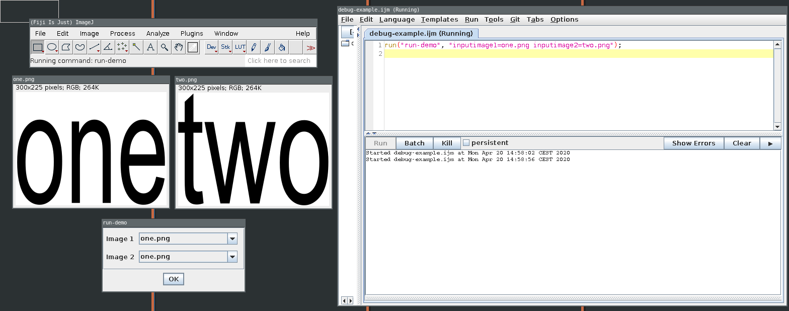

# Minimal plugin with two Dataset Parameters...

The plugin itself does nothing. It takes two images as inputs and prints a debug message when it is run.

## Building/installation

### Build:

```bash
mvn
```

### Installation

If you don't want to build it yourself, there is a jar [here]().

copy the produced jar from the `target` folder to your `Fiji/plugins` folder.

issue can be reproduced using the files in the `example` folder:

Just open `example/one.png` and `example/two.png` in Fiji, open the example macro `example/debug-example.ijm`.
You will notice that it produces a debug message as expected (so the code runs), but it will show a pop-up window asking for the parameters.


Screenshot:


